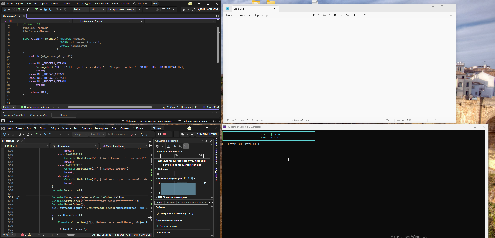
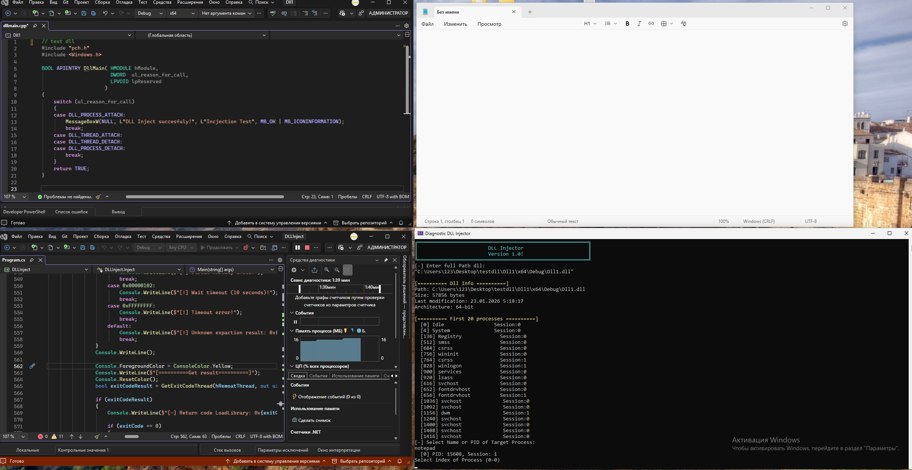
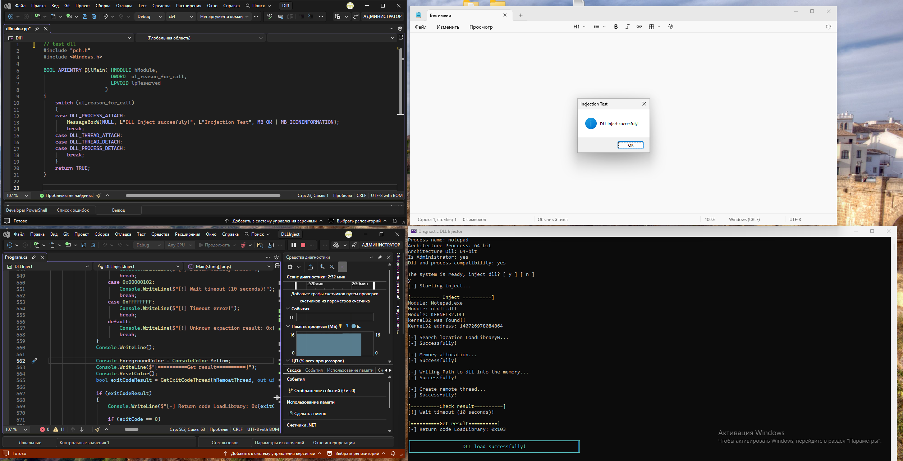

# Dll-Injector Version 1.0

**Application for injection dll to already running processes.**
**The core application is written entirely in C#. Currently, it only supports C/C++ DLLs.**

## Requirements
### Minimum
* [.NET 10.0](https://dotnet.microsoft.com/ru-ru/download/dotnet/10.0) or greater.

* #### Windows:
  * Windows 10
  * Windows 11

## How it work:
###
### Search for [kernel32](https://learn.microsoft.com/en-us/windows/win32/api/winbase/) in current process
  * Because of Address Space Layout Randomization ([ASLR](https://learn.microsoft.com/en-us/windows/win32/procthread/process-security-and-access-rights)), modules are mapped at random base addresses. Therefore, it is necessary to find the base address of kernel32.dll within the address space of the target process.

  * To accomplish this, the [CreateToolhelp32Snapshot](https://learn.microsoft.com/en-us/windows/win32/api/tlhelp32/nf-tlhelp32-createtoolhelp32snapshot) function can be utilized. By taking a snapshot of the loaded modules in the target process, we can then traverse the module list to find the base address of kernel32.dll.
    The obtained module information should be stored in a pre-declared [MODULEENTRY32](https://learn.microsoft.com/en-us/windows/win32/api/tlhelp32/ns-tlhelp32-moduleentry32) structure.
```
private const uint TH32CS_SNAPMODULE = 0x00000008;
[DllImport("kernel32.dll", SetLastError = true)]
static extern IntPtr CreateToolhelp32Snapshot(uint dwFlags, uint th32ProcessID);

snapshot = CreateToolhelp32Snapshot(TH32CS_SNAPMODULE, (uint)ProcessID);

                if (snapshot == IntPtr.Zero || snapshot.ToInt64() == -1)
                {
                    int error = Marshal.GetLastWin32Error();
                    Console.WriteLine($"ошибка снимка {error}");
                    return (IntPtr.Zero, 0);
                }
MODULEENTRY32 lpme = new MODULEENTRY32();
```
  * Following the creation of a snapshot with [CreateToolhelp32Snapshot](https://learn.microsoft.com/en-us/windows/win32/api/tlhelp32/nf-tlhelp32-createtoolhelp32snapshot), the modules within it can be enumerated by employing the [Module32Next](https://learn.microsoft.com/en-us/windows/win32/api/tlhelp32/nf-tlhelp32-module32next) function in a loop.
```
while (Module32Next(snapshot, ref lpme));
```
### Search for [LoadLibraryW](https://learn.microsoft.com/en-us/windows/win32/api/libloaderapi/nf-libloaderapi-loadlibraryw) function in kernel32
  * After locating kernel32.dll in the current process, the next step is to find the address of the LoadLibrary function within it. A common technique is to load the same DLL into the address space of the local process (where its handle is already known) and calculate the offset of LoadLibrary. This works because although ASLR randomizes      the base address of modules, the relative offsets of functions inside the module are fixed.

  * Once you have the function's address within kernel32 in your local process, you can calculate its address in the target process using the formula:
    remote_function_address = remote_kernel32_base + (local_function_address - local_kernel32_base)
    
  * To pass the DLL path as an ASCII string, use the [LoadLibraryA](https://learn.microsoft.com/en-us/windows/win32/api/libloaderapi/nf-libloaderapi-loadlibrarya) function. For Unicode (UTF-16) strings, use [LoadLibraryW](https://learn.microsoft.com/en-us/windows/win32/api/libloaderapi/nf-libloaderapi-loadlibraryw).
```
 (IntPtr remoteKernel32Base, uint remoteKernel32Size) = FindKernel32InProcess(CurrentProcess);
                Console.WriteLine();

                IntPtr localKernel32Base = GetModuleHandle("kernel32.dll");

                IntPtr localLoadLibraryAddr = GetProcAddress(GetModuleHandle("kernel32.dll"), "LoadLibraryW");

                long offsetInsideKernel32 = localLoadLibraryAddr.ToInt64() - localKernel32Base.ToInt64();

                Console.WriteLine("Search location LoadLibraryW...");
                IntPtr remoteLoadLibraryW = new IntPtr(remoteKernel32Base.ToInt64() + offsetInsideKernel32);

                long kernel32EndAddr = remoteKernel32Base.ToInt64() + (long)remoteKernel32Size;
```
### Take handle
  * Once the address of [LoadLibraryW](https://learn.microsoft.com/en-us/windows/win32/api/libloaderapi/nf-libloaderapi-loadlibraryw) in the target process has been determined, the next step is to acquire a handle to that process with sufficient access rights, by [calling the OpenProcess](https://learn.microsoft.com/en-us/windows/win32/api/processthreadsapi/nf-processthreadsapi-openprocess) function.
```
[DllImport("kernel32.dll", SetLastError = true)]
static extern IntPtr OpenProcess(uint dwDesiredAccess, bool bInheritHandle, int dwProcessId);
IntPtr HandleProcess = OpenProcess(PROCESS_CREATE_THREAD | PROCESS_QUERY_INFORMATION | PROCESS_VM_OPERATION | PROCESS_VM_WRITE | PROCESS_VM_READ, false, CurrentProcess);
```
### Allocation memory
  * With a valid handle to the target process, allocate a region of memory within its address space using [VirtualAllocEx](https://learn.microsoft.com/en-us/windows/win32/api/memoryapi/nf-memoryapi-virtualallocex). This memory will be used to store the full path of the DLL that needs to be injected.
```
[DllImport("kernel32.dll", SetLastError = true)]
static extern IntPtr VirtualAllocEx(IntPtr hProcess, IntPtr lpAddress, uint dwSize, uint flAllocationType, uint flProtect);
IntPtr AllocMem = VirtualAllocEx(HandleProcess, IntPtr.Zero, (uint)dllPath.Length, MEM_COMMIT | MEM_RESERVE, PAGE_READWRITE);
```
### Write the DLL path into the allocated memory ([WriteProcessMemory](https://learn.microsoft.com/en-us/windows/win32/api/memoryapi/nf-memoryapi-writeprocessmemory)).
```
[DllImport("kernel32.dll", SetLastError = true)]
static extern bool WriteProcessMemory(IntPtr hProcess, IntPtr lpBaseAddress, byte[] lpBuffer, uint nSize, out UIntPtr lpNumberOfBytesWritten);
bool resultWrite = WriteProcessMemory(HandleProcess, AllocMem, dllPath, (uint)dllPath.Length, out bytesWritten);
```
### Create remote thread
  * Create a remote thread([CreateRemoteThread](https://learn.microsoft.com/en-us/windows/win32/api/processthreadsapi/nf-processthreadsapi-createremotethread)) in the target process that starts execution at the address of [LoadLibraryW](https://learn.microsoft.com/en-us/windows/win32/api/libloaderapi/nf-libloaderapi-loadlibraryw). The parameter for this thread is remote memory address containing the DLL path, which will cause [LoadLibraryW](https://learn.microsoft.com/en-us/windows/win32/api/libloaderapi/nf-libloaderapi-loadlibraryw) to load the specified DLL into the target process.
```
[DllImport("kernel32.dll", SetLastError = true)]
static extern IntPtr CreateRemoteThread(IntPtr hProcess, IntPtr lpThreadAttributes, uint dwStackSize, IntPtr lpStartAddress, IntPtr lpParameter, uint dwCreationFlags, IntPtr lpThreadId);
IntPtr hRemoatThread = CreateRemoteThread(HandleProcess, IntPtr.Zero, 0, remoteLoadLibraryW, AllocMem, 0, IntPtr.Zero);
```
### Free the memory allocated for the DLL path and close the handles ([VirtualFreeEx](https://learn.microsoft.com/en-us/windows/win32/api/memoryapi/nf-memoryapi-virtualfreeex)) ([CloseHandle](https://learn.microsoft.com/en-us/windows/win32/api/handleapi/nf-handleapi-closehandle)).
```
[DllImport("kernel32.dll", SetLastError = true)]
public static extern bool VirtualFreeEx(IntPtr hProcess, IntPtr lpAddress, UIntPtr dwFreeType, uint dwFreeTupe);
VirtualFreeEx(HandleProcess, AllocMem, UIntPtr.Zero, MEM_RELEASE);

[DllImport("kernel32", SetLastError = true)]
static extern bool CloseHandle(IntPtr hObject);
CloseHandle(hRemoatThread); 
if (HandleProcess != IntPtr.Zero && HandleProcess.ToInt64() != -1) { CloseHandle(HandleProcess);
```
## How to use
 * Start tool as administrator.
 * Enter the path to DLL
 * Select target process
 * Confirm start injection.
 * 
   
 * 
   
 *  
## About
  * This project is in the development stage. Should you have any suggestions for improvements or encounter any issues, we encourage you to submit them via the [issue](https://github.com/SaveKenny01/Dll-Injector/issues).
  * * It might be a heuristic reaction from your antivirus, in which case try disabling it.
  ## DISCLAIMER: I AM NOT RESPONSIBLE FOR ANY ILLEGAL USAGE OF THIS TOOL.
## Additional References
  * [MEM Constants](https://learn.microsoft.com/en-us/windows/win32/memory/memory-protection-constants)
  * [Process Constants](https://learn.microsoft.com/en-us/windows/win32/procthread/process-security-and-access-rights#constants)
  * [CreateToolhelp32Snapshot Constants](https://learn.microsoft.com/en-us/windows/win32/api/tlhelp32/nf-tlhelp32-createtoolhelp32snapshot#parameters)
